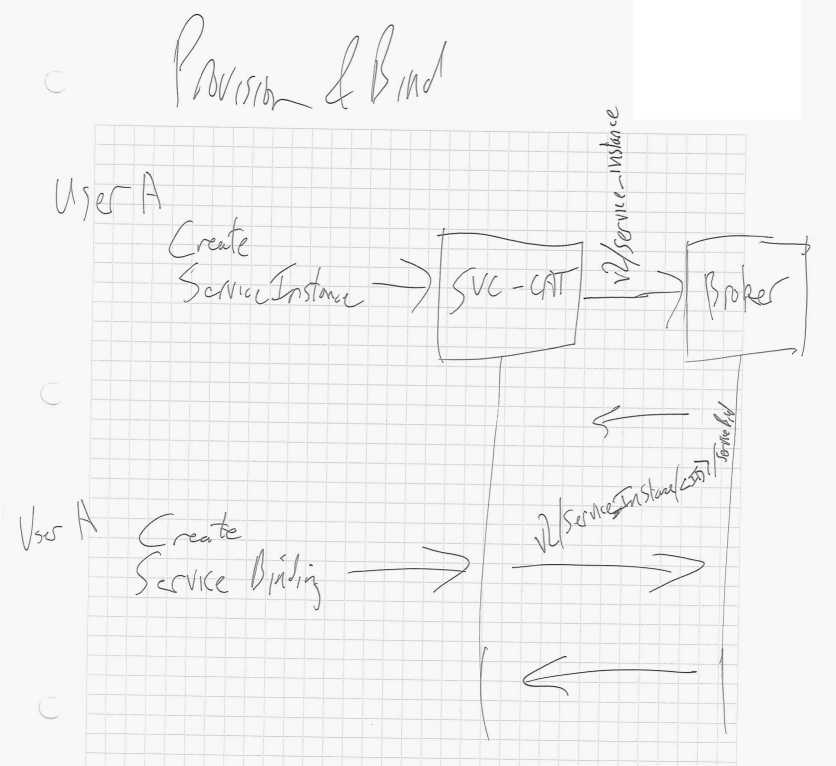
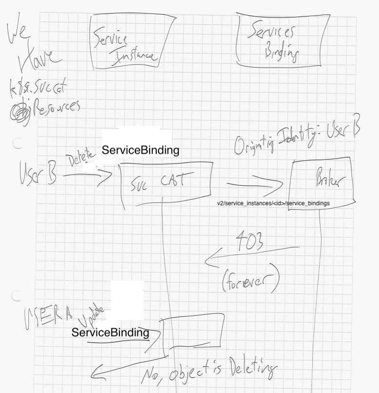

 - User A has permissions to the broker.
 - User B does not have permissions to the broker, but can still see and modify the k8s objects.

User A creates a [ServiceInstance] and binds it by creating a [ServiceBinding].


User B issues DELETE on the ServiceBinding. This is persisted as
[setting the DeletionTimestamp] on the resource. Service-catalog will
try to make the delete real by talking to the broker. Because this is
a different user, it will have a different Originating-Identity
Header. This will cause the broker to reject the request with a 403.

User A will later want to update the ServiceBinding, and be unable to,
as it will be in the deleting state waiting for the finalizer to
run. This state for User A is unacceptable.




### Possible solutions

* hack the apiserver to remove this convention
```
Once the deletionTimestamp is set, this value may not be unset or
be set further into the future, although it may be shortened or the
resource may be deleted prior to this time.
```

* imperative/declarative delete through UPDATE

 - disable user access to DELETE with RBAC
 - add a field that indicates we should go through the delete flow
   - update that field, have platform do the delete on the broker
   - have controller call DELETE on resource if broker sucessfully deletes

[ServiceInstance]: https://github.com/kubernetes-incubator/service-catalog/blob/v0.1.20/pkg/apis/servicecatalog/types.go#L670-L680
[ServiceBinding]: https://github.com/kubernetes-incubator/service-catalog/blob/v0.1.20/pkg/apis/servicecatalog/types.go#L964-L975
[setting the DeletionTimestamp]: https://github.com/kubernetes/community/blob/master/contributors/devel/api-conventions.md#metadata
