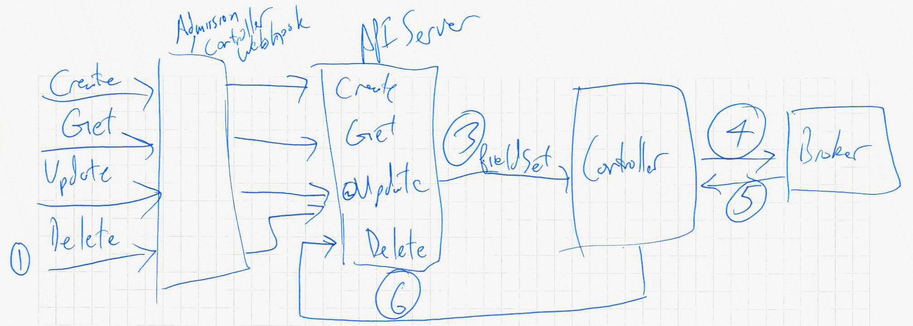

Must decide between kubernetes purity and ease of maintenance.
It seems possible to keep the standard end user api behavior for everything.
This requires the code to get much more complicated.

# Queuing/Journaling/Append-Only Log

This is a proposed solution from upstream for the update issue.

filesystem/database inspired "how do I make something reliable on top
of something unreliable?"

For every write we want to do, stage it first, and then act on it in
order. Queue up changes, then act on them. Every state change is
attributable directly to someone.

Difficult for end users to see what the final state is.  Work required
to simulate the possible final state. We would do this to represent
the spec, so that users doing modifications modify something relevant
to the state they should eventually see when it comes time to process
their update.

Requires a policy on what to do when an update fails, move on, or
halt. 

Work might "back up" and take a while to clear.

 - pros
   - optimistic concurrency, not a big lock
   - no behavior change to external observers
 - cons
   - complicated mechanism for queuing and playing the queue forward
     to simulate the end spec.
 - unknowns
   - how does this interact with a delete? is a delete just another
     operation that gets queued? Dump the queue? Jump the queue?

## Design
Add a third entry on Instances and Bindings, Queue - an ordered collection of
diffs.

In the *UpdateStrategy*, diff the old and the new, and add that diff to the end
of the Queue. Calculate what the new version of the spec should look like given
the queue, and store that as the actual spec.

In the controller, check for a non-empty queue and process one queue item at a
time until there are none left. Define a policy for failures of queue objects.

# Hack the apiserver

This is a proposed solution from upstream for the delete issue. 

Intercept DELETE before persistence. Update a field to indicate that
the backing delete should be done. Eventually, have the controller do
the final delete of kubernetes object (perhaps a subresource or
distinguish by UserAgent, both would allow other clients to override
and issue a direct force delete). 

 - pros
   - everything looks the same from the outside
   - no behavior change to external observers
 - cons
   - huge hack with significant maintenance burden
   - must carry forward the changes when rebasing on new versions of apimachinery
   - unknown/unbounded time commitment to implement

## Design

Go and implement a rest.Store or registry.Store object as appropriate to replace
the built in one for instance and 

# Preflight Checks

There is no preflight for an external
authorization-controller/admission-controller. Even if there was an
auth plugin, it could not be kept in sync at all times.

OSBAPI has no preflight checks for operations like k8s SAR-check. Even
so, again, cannot be kept perfectly in sync at all times.

# Admission Controllers Always

Do all state changes in an admission controller before persisting them.

pros:
 - solves everything

cons:
 - loss of state/data if something gets in a bad state between acting and persistence. 
 - duplicates everything into the apiserver
 
This gets us out of the very restricted set of API Server operations.
It also makes state changes synchronous.

This jumps the state of the broker ahead of what the the apiserver
knows and has persisted until it is done and ready to be committed.
Anything in progress that fails is dropped on the floor. It could be
put into apiserver and through to etcd in a bad state so that users
have feedback on why something has failed. In a bad state, only allow
through updates that succeed.

Update Lock: Try to do the update, if it fails, reject the spec
change.

Delete Rollback: Try to do the delete, if it fails, reject the
request, do not set the deletion timestamp.

# converting admission controller

Can we have an admission controller convert the delete into an update and update the delete-field?

No, not a thing that exists.
