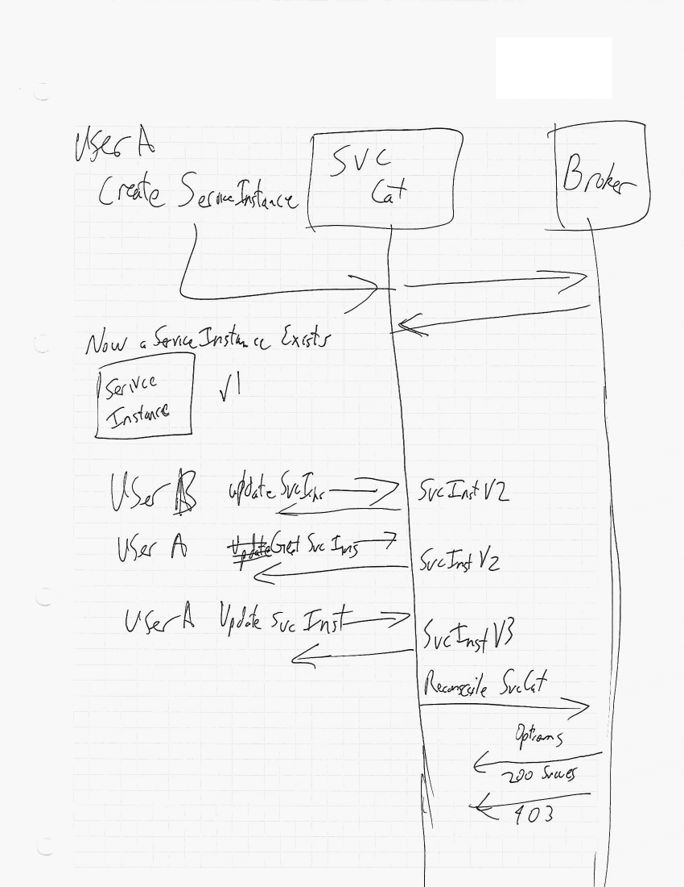

# Update Scenario

## Preconditions
 - User A is authorized on broker.
 - User B is not authorized on broker.
 - Both A & B are authorized in kube.
 - User A has created a ServiceInstance

## Example Flow 



## Unauthorized User causes Failure for Authorized User

 - User A creates resource Instance
 - User B updates the instance to change the plan
   - User B is not allowed
   - Broker rejects the update
   - uninterruptible reconciliation backoff for a long time
     - this is long, because some brokers take hours or days to
       provision the backing instance
 - User A goes to make operations on the Instance and is denied

Right now we have a lock that prevents any updates while waiting for the
reconciliation to end.

Multiple issues here.

## Authorized user accidentally authorizes unauthorized user (without lock)

 - changes made by an unauthorized user without permissions can be taken-over by an
 authorized user. (if we remove the lock)
   - User B makes a change that fails to update
   - User A makes an update before the failure, but after the change and
     thus authorizes a change that wouldn't have been made

```
user b -> update v1 to v2
user a -> get v2
user a -> update v2 to v3 
controller -> get v3
```

# Possible Solutions
## Keep the Lock
Status Quo, irritating but not wrong
##  [Admission Controllers Always]

[Admission Controllers Always]: ../solutions/solutions.md#admission-controllers-always

## Queuing/Journaling/Append-Only Log
